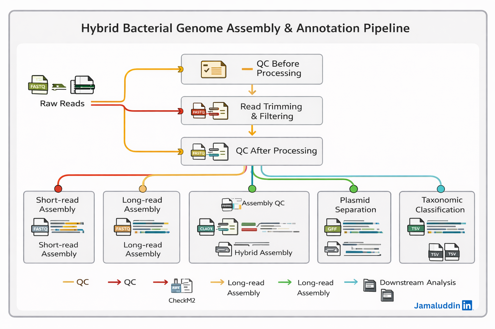

<div align="center">

# 🧬 Hybrid Bacterial Genome Assembly & Annotation Pipeline  
*A reproducible, production-ready pipeline for bacterial genome assembly, quality assessment, and annotation*


</div>

---
This guide provides a comprehensive, step-by-step workflow for assembling bacterial genomes using short reads, long reads, and hybrid approaches. It covers raw data acquisition, quality control, assembly, quality assessment, and annotation, with all commands and scripts provided for reproducibility.


---

## 📑 Table of Contents
| Section | Description |
|---------|-------------|
| [1. Overview](#1-overview) | 30-second elevator pitch |
| [2. Pipeline Overview](#2-pipeline) | What each folder & script does |
| [3. Quick Start](#3-quick-start) | Install → Run in 3 commands |
| [4. Workflow Steps](#4-workflow-steps) | Walk-through of numbered folders |
| [5. Outputs Cheat-Sheet](#5-outputs-cheat-sheet) | Key files to look for |
| [6. Quality Benchmarks](#6-quality-benchmarks) | Rules-of-thumb table |
| [7. Citation](#7-citation) | Please cite us |


---

## 1. Overview
This repository provides a complete end-to-end workflow for assembling bacterial genomes using:

* Short-read only (Illumina)  
* Long-read only (Nanopore/PacBio)  
* Hybrid (both data types combined)

All tools are executed inside isolated conda environments, ensuring reproducibility, portability, and long-term usability. 
bash scripts `bash analysis.sh` automate every step.

---

## 2. Pipeline Overview:
The following diagram illustrates the complete workflow implemented in this repository, from raw sequencing reads to final genome annotation and taxonomic classification.


## 3. Quick Start
# a. Installation script:
```
bash 'installation.sh'
```
⚠️ Requires Conda / Mamba and ~250 GB disk space for databases.

🚀 Run the pipeline (for each sample)
# b. Place raw reads in:
```
example data: BioProject: PRJNA244942
01_raw_reads/
├── short_reads/*.fastq.gz
└── long_reads/*.fastq.gz
```

# c. Analysis script:
```
bash 'analysis.sh'
```

---
## 4. Workflow Steps

| Stage | Folder                            | What happens                                                                                                                   |
| ----- | --------------------------------- | ------------------------------------------------------------------------------------------------------------------------------ |
| 0     | `00_papers/`                      | keep PDFs for methods citations                                                                                                |
| 1     | `01_raw_reads/`                   | pipeline expects:<br>`short_reads/xxx_1.fastq.gz` & `xxx_2.fastq.gz`<br>`long_reads/xxx.fastq.gz`                              |
| 2     | `02_reads_QC_before_processing/`  | fastqc + NanoPlot pre-trimming                                                                                                 |
| 3     | `03_reads_processed/`             | fastp (short) & NanoFilt (long) cleaned reads                                                                                  |
| 4     | `04_reads_QC_after_processing/`   | fastqc + NanoPlot post-trimming                                                                                                |
| 5     | `05_hybrid_genome_assembly/`      | Unicycler in three modes:<br>`01_short_only_assembly/`<br>`02_long_only_assembly/`<br>`03_hybrid_assembly/` ← **use this one** |
| 6     | `06_genome_quality_assessment/`   | CheckM2, QUAST, BUSCO on **all three assemblies**                                                                              |
| 7     | `07_genome_annotation/`           | Prokka & Bakta on all three assemblies                                                                                         |
| 8     | `08_plassembler_output/`          | hybrid reads → chromosome vs plasmids                                                                                          |
| 9     | `09_assembly_quality_assessment/` | final CheckM2/QUAST/BUSCO on **Plassembler-polished** assembly                                                                 |
| 10    | `10_abricate_results/`            | CARD, ResFinder, VFDB, NCBI-AMR hits                                                                                           |
| 11    | `11_genomad_results/`             | geNomad conservative & relaxed / Prophages & plasmidsruns                                                                                            |
| 12    | `12_gtdbtk_classification/`       | Taxonomic assignment tree                                                                                                 |

---
## 5. Outputs Cheat-Sheet

| What you need | Where to find it                                                          |
| ------------- | ------------------------------------------------------------------------- |
| Final FASTA   | `08_plassembler_output/assembly.fasta`                                    |
| Final GBK     | `07_genome_annotation/02_bakta/03_hybrid_assembly/jk_bakta_hybrid.gbff`   |
| Completeness  | `09_assembly_quality_assessment/01_checkm2/quality_report.tsv`            |
| Contigs / N50 | `09_assembly_quality_assessment/02_quast/quast_results/report.txt`        |
| BUSCO score   | `09_assembly_quality_assessment/03_busco/busco_results/short_summary.txt` |
| AMR summary   | `10_abricate_results/abricate_summary.tsv`                                |
| Taxonomy      | `12_gtdbtk_classification/gtdbtk.bac120.summary.tsv`                      |
---

## 6. Quality Benchmarks

| Metric                 | Acceptable                | Excellent |
| ---------------------- | ------------------------- | --------- |
| Genome size            | 4–6 Mb (typical bacteria) |     ✔     |
| Contigs                | ≤ 50                      | ≤ 5       |
| N50                    | ≥ 100 kb                  | ≥ 1 Mb    |
| CheckM2 completeness   | ≥ 90 %                    | ≥ 98 %    |
| CheckM2 contamination  | ≤ 5 %                     | ≤ 1 %     |
| BUSCO (bacteria)       | ≥ 95 % complete           | ≥ 99 %    |
| GTDB-Tk classification | species with ANI ≥ 95 %   |      ✔    |

---
## 7. Citation

* Wick et al., 2017 – Unicycler
* Chklovski et al., 2023 – CheckM2
* Gurevich et al., 2013 – QUAST
* Manni et al., 2021 – BUSCO
* Seemann, 2014 – Prokka
* Schwengers et al., 2021 – Bakta
* Stewart et al., 2023 – Plassembler
* Antipov et al., 2023 – geNomad
* Chaumeil et al., 2022 – GTDB-Tk

---
## Happy assembling!
Open an issue if anything breaks

---
## Acknowledgement:
* [Dr.AammarTufail](https://github.com/AammarTufail)
* [Bioinformatics_ka_chilla](https://github.com/AammarTufail/bioinformatics_ka_chilla)
---
